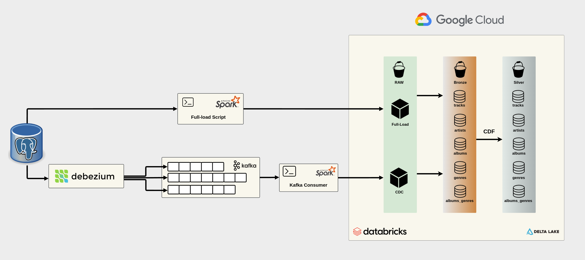

<h2 align="center"> 
	🚧 Music Catalog Data Lake 🚧
</h2>


<p align="center">
  

 
	
 

  
</p>

# Music Data Lake

## Description
The **Music Data Lake** is a project focused on collecting, processing, and analyzing music data. It leverages technologies such as Apache Spark, Docker, and Debezium to handle large volumes of data and enable scalable analytics. The project includes full load and change data capture (CDC) ingestion into Databricks, organizing data into `raw` and `bronze` catalogs. Additionally, Apache Kafka is used to create Debezium topics and manage the consumer that retrieves CDC data for ingestion into the bucket.

## Technologies Used
- **Apache Spark** - Distributed processing of large datasets.
- **Docker & Docker Compose** - Containerization for easy deployment.
- **Debezium** - Real-time data capture.
- **Apache Kafka** - Message broker for CDC data streaming.
- **PostgreSQL** - Structured data storage.
- **Google Cloud Storage (GCS)** - Storage for full load and CDC ingestion.
- **Databricks** - Data processing and management using `raw`, `bronze`, and `silver` catalogs.
- **dbt Core** - Dimensional data modelling for `gold` layer + integrity tests.
- **Music APIs** - Data collection from external services.

## Current Architecture
The project is still under development. But we can already see the road so far


## Project Structure
```
/music_data_lake
├── .github/workflows/   # CI/CD for Databricks Workflows
│── api_consumer/        # Scripts for consuming music APIs
├── music_data_dbt/      # dbt project for dimensional modeling (Gold Layer)
│── queries/             # SQL queries for data extraction and analysis
│── spark_files/         # Extraction structure and ingestion scripts for full load and CDC into GCS
│── src/                 # Core ingestion logic for Databricks
│   ├── bronze/          # Handles ingestion into the `bronze` catalog
│   ├── silver/          # Handles ingestion into the `silver` catalog
│   ├── lib/             # Utility functions and libraries for processing
│── Dockerfile           # Docker container configuration
│── docker-compose.yml   # Service orchestration with Docker Compose
│── debezium.json        # Configuration for real-time data capture
```

## How to Run the Project
1. Clone the repository:
   ```bash
   git clone https://github.com/rmendes1/music_data_lake.git
   cd music_data_lake
   ```
2. Start the Docker containers:
   ```bash
   docker-compose up -d
   ```
3. Execute the data processing scripts as needed.
   - DB source construction queries are in `queries/`
   - Extraction and ingestion logic is in `spark_files/`
   - Data ingestion into Databricks (`raw` and `bronze`) is handled in `src/`
   - Kafka topics and CDC consumer scripts are managed in `debezium.json` and in `spark_files/spark_apps/manage_offset.py`

4. Gold Layer (Dimensional Modeling with dbt)

	The `music_data_dbt` directory houses the dbt project responsible for the Gold Layer. This layer implements a dimensional modeling approach, creating fact and dimension tables to facilitate efficient querying and analysis.
	
	Key features include:
	
	- **Fact Tables**: Capture measurable events such as song plays, user interactions, etc.
	- **Dimension Tables**: Provide context to facts, including information about artists, albums, users, and time.
	- **dbt Models**: Modular SQL models that define the transformations from staging to gold layer.
	- **Testing and Documentation**: dbt's built-in testing and documentation features ensure data quality and clarity.
	
	```text
						          +----------------+
						          |  dim_artists   |
						          +----------------+
						                  |
						                  v
						          +----------------+
						          |  dim_albums    |
						          +----------------+
						                  |
						                  v
						        +---------------------+
						        | bridge_album_genre  |
						        +---------------------+
						         ^                 ^
						         |                 |
						+----------------+   +----------------+
						|  dim_genres    |   |  fact_tracks   |
						+----------------+   +----------------+
	```
	
	**Component Description**
	
	- `dim_artists`: One record per artist, containing artist attributes.
	- `dim_albums`: One record per album, including album attributes and a foreign key to the artist.
	- `dim_genres`: One record per genre.
	- `bridge_album_genre`: Links each album to all associated genres (many-to-many relationship).
	- `fact_tracks`: One record per track, with foreign keys to album and artist (does not include genre directly).
	
	**Relationships Structure**
	
	- `fact_tracks` references `dim_albums` and `dim_artists`.
	- `dim_albums` references `dim_artists` (one-to-many).
	- `bridge_album_genre` creates a **many-to-many** relationship between `dim_albums` and `dim_genres`.
	
	To perform genre-based analysis, you should join:
	`fact_tracks` → `dim_albums` → `bridge_album_genre` → `dim_genres`
	
	Note: You can connect `fact_tracks` to `dim_albums` and, through the bridge, reach `dim_genres` for genre-level analysis.
	
	To work with the dbt project:
	
	1. Navigate to the `music_data_dbt` directory.
	2. Install dependencies: `dbt deps`
	3. Run models: `dbt run`
	4. Test models: `dbt test`
	5. Generate documentation: `dbt docs generate` and view it with `dbt docs serve`

## License
This project is licensed under the MIT License - see the [LICENSE](LICENSE) file for details.

