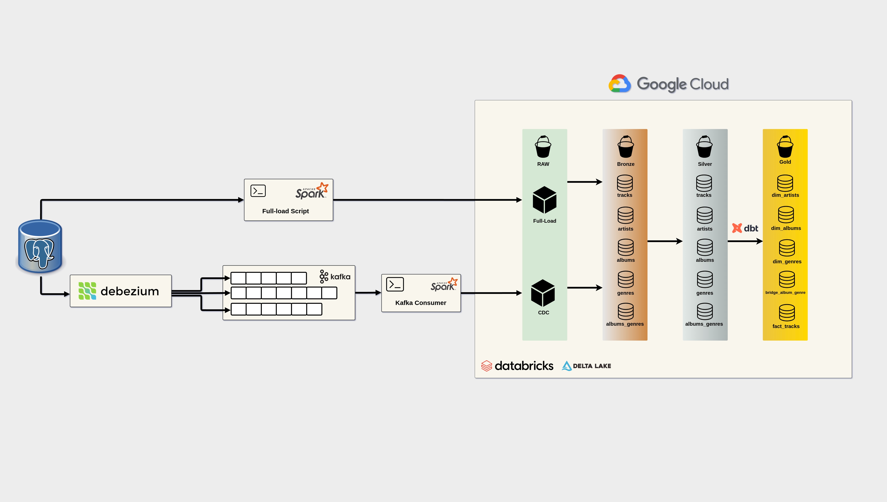

<h2 align="center"> 
	🚧 Music Catalog Data Lake 🚧
</h2>


<p align="center">
  

 
	
  
  <a href="https://github.com/rmendes1/house-rocket/commits/main">
    
  </a>

  
</p>

# Music Data Lake

## Description
The **Music Data Lake** is a project focused on collecting, processing, and analyzing music data. It leverages technologies such as Apache Spark, Docker, and Debezium to handle large volumes of data and enable scalable analytics. The project includes full load and change data capture (CDC) ingestion into Databricks, organizing data into `raw` and `bronze` catalogs. Additionally, Apache Kafka is used to create Debezium topics and manage the consumer that retrieves CDC data for ingestion into the bucket.

## Technologies Used
- **Apache Spark** - Distributed processing of large datasets.
- **Docker & Docker Compose** - Containerization for easy deployment.
- **Debezium** - Real-time data capture.
- **Apache Kafka** - Message broker for CDC data streaming.
- **PostgreSQL** - Structured data storage.
- **Google Cloud Storage (GCS)** - Storage for full load and CDC ingestion.
- **Databricks** - Data processing and management using `raw` and `bronze` catalogs.
- **Music APIs** - Data collection from external services.

## Current Architecture
The project is still under development. But we can already see the road so far
<h1 align="center">
    
</h1>

## Project Structure
```
/music_data_lake
│── api_consumer/        # Scripts for consuming music APIs
│── queries/             # SQL queries for data extraction and analysis
│── spark_files/         # Extraction structure and ingestion scripts for full load and CDC into GCS
│── src/                 # Core ingestion logic for Databricks
│   ├── bronze/          # Handles ingestion into the `bronze` catalog
│   ├── lib/             # Utility functions and libraries for processing
│── Dockerfile           # Docker container configuration
│── docker-compose.yml   # Service orchestration with Docker Compose
│── debezium.json        # Configuration for real-time data capture
```

## How to Run the Project
1. Clone the repository:
   ```bash
   git clone https://github.com/rmendes1/music_data_lake.git
   cd music_data_lake
   ```
2. Start the Docker containers:
   ```bash
   docker-compose up -d
   ```
3. Execute the data processing scripts as needed.
   - DB source construction queries are in `queries/`
   - Extraction and ingestion logic is in `spark_files/`
   - Data ingestion into Databricks (`raw` and `bronze`) is handled in `src/`
   - Kafka topics and CDC consumer scripts are managed in `debezium.json` and in `spark_files/spark_apps/manage_offset.py`

## License
This project is licensed under the MIT License - see the [LICENSE](LICENSE) file for details.

